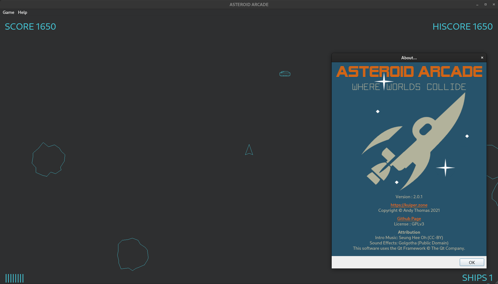

# ASTEROID ARCADE #
ASTEROID ARCADE is an open source cross-platform "retro vector" game written
in C++ and utiling the Qt Framework. It is licensed under GPLv3.

## Running the Game ##
Download the latest "release" of ASTEROID ARCADE from Github for a pre-built application for both Linux and Windows.

[**DOWNLOAD RELEASE**](https://github.com/KuiperZone/ASTEROID-ARCADE/releases/latest)

The game does not store state between application launches.

## More About the Game ##
Clearly, ASTEROID ARCADE takes inspiration from the 1979 classic, Atari Asteroids,
although there are some signficant differences (it would not be true to say that it
is a clone). In Atari Asteroids, for example, asteroids do not collide but simply
overlap when they encounter each other. In ASTEROID ARCADE, however, things are a
little more energetic as the game implements a conservation of momentum rule and,
as a result, things have a tendency to collide and explode.

The game was primarily written for fun and has served me as a way to learn new
programming frameworks. I originally wrote an early version of it around 2003.
I had made the decision to implement the game logic in pure C++ and this made
it easy to port it to different GUI development frameworks at various times
since. An early variant, for example, employed wxWidgets.

This version, called "ASTEROID ARCADE", links against the Qt Framwork. And here
it is. I hope you enjoy it!

For a detailed explanation of the source code: https://kuiper.zone/asteroids-game-in-c-qt/

## Credits and Attribution ##
ASTEROID ARCADE features music originally recorded by Seung Hee Oh and used under
a Creative Commons (CC-BY) license. Additionally, sound effects files originate, from
a game called "Golgotha" and are in the public domain.
